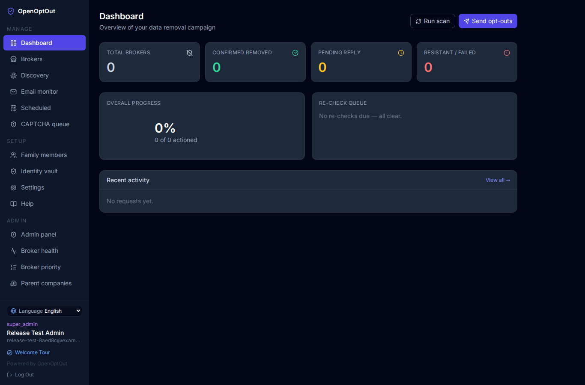
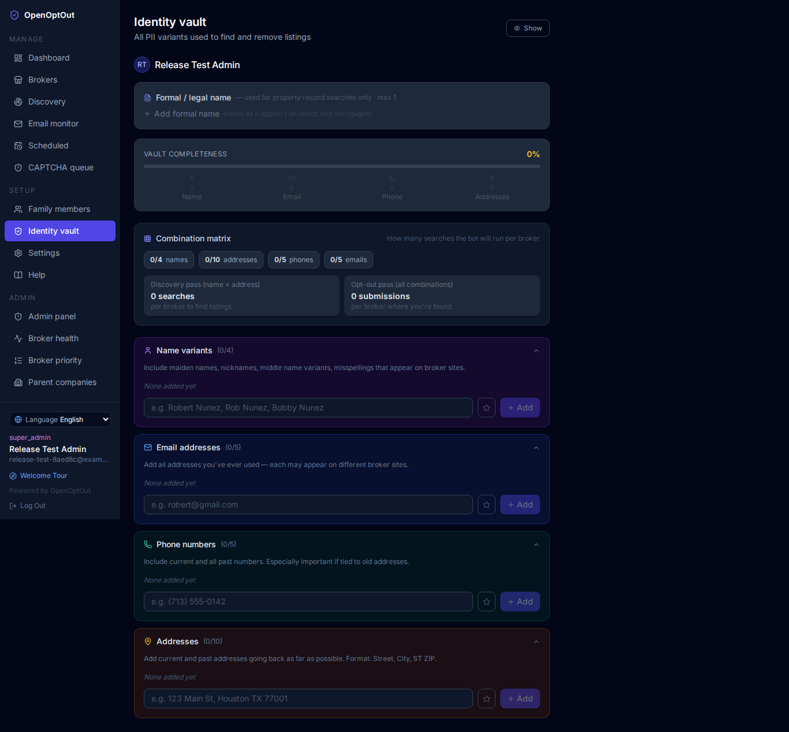

# OpenOptOut

**Open-source personal data removal pipeline.** A modular, plugin-driven privacy automation platform to opt out of data brokers, track removal status, monitor confirmation emails, and automatically schedule re-checks so brokers can't quietly re-list you.

Built for two audiences from the same codebase:

- **Families** — one system, multiple members, role-based access so parents can manage their kids' data and spouses can manage each other's.
- **Institutions** (libraries, HR departments, credit unions) — white-label branding, SSO/LDAP/SIP2 authentication, patron self-service, PostgreSQL for scale, database encryption, and usage reporting.

> **License:** GNU AGPL-3.0. You may use, modify, and self-host freely; if you run a modified version as a network service, you must make your source available to its users. See [License](#license).

---

## Why this exists — and why it shouldn't have to

OpenOptOut is a **stopgap.** It should not need to exist.

Having to hunt down data brokers and repeatedly beg, form by form, to remove your own personal records is proof of a broken system. You should own your data by default, and no one should have to pay a commercial subscription to reclaim what was always theirs.

The real fix is not software — it is enforceable legislation that outlaws the non-consensual collection and sale of personal information. Until that right is guaranteed by law, OpenOptOut exists as a free, open-source defense for families and communities today, with a singular ultimate goal: **to become obsolete the day comprehensive privacy laws take effect.**

### A note to libraries

Article VII of the ALA *Library Bill of Rights* calls on libraries to protect and advocate for patron privacy. Having served on the Intellectual Freedom Committee's Privacy Sub-Committee (2018–2022) and helped draft Article VII, I built OpenOptOut with that exact mission in mind. Data brokers traffic in the very personal information libraries are dedicated to safeguarding.

This is an open invitation to participate at whatever scale fits your institution:

- **Deploy as a public service** — Offer patron self-service removals alongside public internet access, pre-configured with SIP2 library card authentication and institutional branding.
- **Educate your community** — Weave digital privacy, data broker literacy, and cyber-safety into existing computer classes and patron workshops.
- **Advocate for reform** — Champion non-partisan, loophole-free privacy legislation that makes tools like this obsolete. See our advocacy guide in [`docs/LEGISLATION.md`](docs/LEGISLATION.md).

---

## What it does

OpenOptOut automates the end-to-end data removal lifecycle:

1. **Secure Identity Vault** — Store all name variants, aliases, emails, phone numbers, and deed/mortgage addresses in an encrypted, zero-knowledge vault.
2. **Automated Discovery** — Scan broker databases to pinpoint where your personal listings appear before filing removals.
3. **Modular Removal Engine** — Execute opt-outs via pluggable broker modules and declarative Playwright browser automation, with corporate parent-company batching.
4. **Email Confirmation Tracking** — Monitor a dedicated inbox via OAuth 2.0 to match and verify incoming broker removal confirmations automatically.
5. **Continuous Re-Check Defense** — Automatically re-verify and re-submit requests on a scheduled cadence so brokers cannot quietly re-list you.

### Built for Scale & Institutions
- **Distributed Execution** — Scale headless browser automation across independent worker nodes via Redis priority queues.
- **Consortium & Enterprise Ready** — Multi-branch partitioning with SIP2/ILS library card login, OIDC/SAML 2.0 SSO, and delegated staff permissions.
- **Security & Compliance** — Full database encryption (SQLCipher), field-level encryption, ephemeral memory zeroization, and audit logging.

---

## Screenshots

| Family Dashboard | Identity Vault |
|:---:|:---:|
|  |  |
| *Status overview across all family members* | *Store name variants, addresses, phones, emails* |

---

## Quick start

### One-line install (recommended)

```bash
curl -fsSL https://raw.githubusercontent.com/rlnunez/OpenOptOut/main/install.sh | sh
```

Detects your situation and does the right thing: uses Docker if it's installed and running, or — on a Debian/Ubuntu host run as root with no Docker — installs natively (systemd + nginx, no containers) instead. Safe to re-run (updates an existing checkout rather than duplicating it; never touches an existing `.env`). Force one path explicitly with `| sh -s -- --docker` or `| sh -s -- --native`; see `install.sh --help` for every flag (custom install directory, git ref, fork URL, etc). Piping a script straight into a shell is a judgment call — if you'd rather read it first, that's exactly what the sections below walk through by hand.

### Docker (manual)

```bash
# 1. Clone
git clone https://github.com/rlnunez/OpenOptOut.git openoptout
cd openoptout

# 2. Create environment file
cp .env.example .env
# Edit .env and set SECRET_KEY to a random string:
#   openssl rand -hex 32

# 3. Start
docker compose up -d

# 4. Open http://localhost in your browser
#    The first user to register becomes the super admin
```

The database is stored in a Docker volume so it persists across restarts. For a real deployment reachable by other people, also turn on HTTPS — see [docs/HTTPS.md](docs/HTTPS.md).

### Local development (no Docker)

For a local development environment with hot reload (FastAPI backend + Vite React frontend) or running Playwright tests directly, see the [Local Development Guide](docs/DEVELOPMENT.md). For institutional production deployments without Docker (systemd + nginx / Windows Service + IIS), see [docs/NATIVE_INSTALL.md](docs/NATIVE_INSTALL.md).

---

## First-time setup checklist

On a fresh install the app shows a create-administrator screen instead of a login page; that account becomes the super admin. A guided **setup wizard** then walks through database, email, branding, and HTTPS deployment. Every step is skippable, and everything it sets can be changed later in Settings. The checklist below covers the same ground plus what comes after:

- [ ] **Email** (wizard or Settings → Email) — connect your dedicated removal inbox via OAuth 2.0 (recommended) or App Password (see [Email setup](#email-setup))
- [ ] **Brokers & Plugins** (Brokers / Plugins page) — configure your target broker catalog and enable broker plugins or import custom specs (CSV/JSON)
- [ ] **Family members** — add yourself and family members (Settings → Family Members)
- [ ] **Identity Vault** — fill in name variants, former addresses, and phone numbers for each member (the more identifiers, the better the removal match)
- [ ] **Discovery scan** (optional) — run Discovery to identify which brokers actually list your family before submitting removals
- [ ] **HTTPS** (production) — run `./scripts/enable-https.sh` (or `.ps1`) to configure HTTPS (Caddy, Traefik, Cloudflare Tunnel/DNS, or InCommon) and rate limiting before inviting users (see [docs/HTTPS.md](docs/HTTPS.md))

---

## User roles

OpenOptOut uses role-based access control. The first registered user is automatically a **Super Admin**.

| Role | What they can do | Best for |
|---|---|---|
| **Super Admin** | Everything: system settings, branding, email config, user roles, database management, view all family data | The person running the server |
| **Admin** | Manage users, view reports, manage broker scripts; cannot change branding, email config, or delete the instance | IT staff, department heads |
| **Manager** | Delegated administrative tasks (e.g. plugin management, broker review) without full system access | Staff managing operations |
| **Parent** | Add/edit family members, manage identity vault, trigger removals, view status | Household heads, library staff |
| **Member** | View their own removal status and identity vault; cannot view other members' data | Children, patrons, individual employees |

---

## Institutional deployments

OpenOptOut is designed from the ground up for libraries, schools, credit unions, and non-profits:

- **Patron self-service:** Users register with their email or library card and manage only their own (and their dependents') data.
- **Single sign-on:** Integrate with your existing identity provider using OIDC, SAML 2.0, LDAP, or SIP2 (see [docs/SSO.md](docs/SSO.md)).
- **White-label branding:** Set your institution's name, logo, accent colors, and custom privacy policy link in the Admin panel.
- **Enterprise database:** Switch to PostgreSQL with mTLS, Kerberos, or Cloud IAM authentication (see [docs/DATABASE.md](docs/DATABASE.md)).

---

## Email setup

OpenOptOut needs an email account to send removal requests and receive confirmations.

> ⚠️ **Use a dedicated address.** Brokers sometimes add opt-out requesters to new marketing lists — containing that in a separate inbox keeps your personal email clean.

Supported providers: **Gmail, Outlook, Yahoo, Fastmail, ProtonMail** (via Bridge), or any standard IMAP/SMTP server.

- **OAuth 2.0 (Recommended — Highest Security):** Connect your inbox using modern token-based OAuth via the setup wizard or Settings → Email (supported for Gmail and Outlook). OAuth eliminates static stored passwords, restricts access strictly to required mail scopes, avoids weakening enterprise tenant policies in Google Workspace or Microsoft 365, and supports automatic token refresh and immediate revocation without altering your main account credentials.
- **App Passwords / SMTP (Fallback):** For providers that do not support OAuth integrations (such as Fastmail, Yahoo, or custom IMAP/SMTP servers), generate a provider-specific App Password in your provider's security settings (e.g. Google Account → Security → App Passwords). Never use your primary account password.

---

## Documentation Hub

Detailed technical guides and architectural specifications are organized in [`docs/`](docs/):

| Guide | Description |
|---|---|
| [`docs/ARCHITECTURE.md`](docs/ARCHITECTURE.md) | System architecture, pipeline stages, APScheduler jobs, failure diagnostics, and full repository structure |
| [`docs/DATABASE.md`](docs/DATABASE.md) | PostgreSQL scaling, enterprise auth (mTLS, IAM, Kerberos), SQLite migration, and encryption at rest |
| [`docs/DEVELOPMENT.md`](docs/DEVELOPMENT.md) | Local developer environment setup, Playwright dependencies, and test suite execution |
| [`docs/HTTPS.md`](docs/HTTPS.md) | Production HTTPS setup: built-in Caddy/Traefik front door (Let's Encrypt or Cloudflare DNS), Cloudflare Tunnel, native certbot/win-acme, and reverse proxies |
| [`docs/SSO.md`](docs/SSO.md) | Single sign-on: OIDC, SAML 2.0, Active Directory / LDAP, and library card (SIP2/SIP2S) authentication |
| [`docs/NATIVE_INSTALL.md`](docs/NATIVE_INSTALL.md) | Production deployment without containers (systemd + nginx on Linux, Windows Service + IIS on Windows) |
| [`docs/INTERPRETER.md`](docs/INTERPRETER.md) | Declarative broker-spec interpretation engine and modern add-on format |
| [`docs/PLUGINS.md`](docs/PLUGINS.md) | Process-isolated gRPC plugin system, capability model, and developer SDK |
| [`docs/LEGISLATION.md`](docs/LEGISLATION.md) | Plain-language advocacy guide and policy principles for comprehensive data-broker legislation |
| [`docs/ROADMAP.md`](docs/ROADMAP.md) | Comprehensive architectural roadmap and work-item status |

---

## Upgrading

```bash
git pull
docker compose down
docker compose build
docker compose up -d
```

The database schema is auto-migrated on startup via SQLAlchemy `create_all` (additive changes only). For destructive schema changes, a migration note will appear in the release notes.

**Upgrading from a pre-consolidation deployment:** older versions used three separate volumes (`db_data`, `screenshots`, `logo_data`); the current `docker-compose.yml` uses a single `app_data` volume mounted at `/data`. If you're upgrading and want to keep existing data, either (a) keep your old `docker-compose.yml` volume definitions, or (b) copy the contents of the old `db_data` volume into the new `app_data` volume before starting. New deployments need no action.

---

## Contributing

We welcome community contributions! High-value areas include:

- **Security & code review** — review our sandboxing, cryptography, and auth architecture (see below).
- **New broker entries** — add brokers via the UI and export JSON.
- **Per-broker form selectors** — map CSS selectors for automated submissions in the Admin panel.
- **Resistant vendor guides** — document working removal methods for difficult brokers.
- **Bug reports & test cases** — help improve platform stability.

See [`CONTRIBUTING.md`](CONTRIBUTING.md) and [`docs/DEVELOPMENT.md`](docs/DEVELOPMENT.md) for full contribution guidelines, testing instructions, and developer setup.

---

## Security notes

- Credentials (IMAP/SMTP passwords, LDAP/SIP2/OIDC secrets) are encrypted at rest using Fernet symmetric encryption.
- **PII field encryption** — names, addresses, phones, and emails can be Fernet-encrypted before database writes (`FIELD_ENCRYPTION_KEY`).
- **Full-database encryption** — SQLCipher AES-256 encrypts the entire SQLite file (`DB_ENCRYPTION_KEY`). See [`docs/DATABASE.md`](docs/DATABASE.md).
- **Secrets stay out of the app** — database and proxy credentials, certs, and keys are read only from environment variables or mounted files (Docker/K8s secrets, Vault), never stored in the database or settings, never logged.
- The database contains PII — keep your Docker volume secure and off public-facing storage.
- The `SECRET_KEY` env var must be set to a strong random value in production: `openssl rand -hex 32`.
- Generate separate keys for `DB_ENCRYPTION_KEY` and `FIELD_ENCRYPTION_KEY` rather than reusing `SECRET_KEY`.
- All API endpoints are authenticated; the only public route is `/api/health`.
- Role-based access is enforced server-side — a parent cannot access another family's data even with direct API calls, and the child-per-parent limit is enforced on the server.
- **Bot-evasion is honestly scoped** — user-agent rotation and proxies help against IP/UA blocking but do not defeat advanced fingerprinting; see the in-app Help for the full picture.
- **Put it behind HTTPS** before real people use it — staff/patron passwords and SSO tokens should never cross the network in plain HTTP. See [`docs/HTTPS.md`](docs/HTTPS.md).

---

## Development disclosure & security review

OpenOptOut handles sensitive personal information, which demands rigorous security. As the original developer, my personal background in advanced security architecture is limited. To implement complex subsystems like the Bubblewrap sandbox, gRPC capability broker, SQLCipher database encryption, and SSO integrations, I utilized AI assistants (specifically Claude and Gemini) to help design and write these components. In addition, I also used them to bounce ideas off of for the project's direction, help keep track of the roadmap, and aid in testing. I am one person that has limited time in the day.

While I have actively reviewed, tested, and worked to understand the code introduced, I am human and know that AI-generated code can carry subtle edge cases. If you have expertise in application security, Linux sandboxing, or cryptography, **community code reviews and security feedback are deeply appreciated.**

Ideally, OpenOptOut will undergo a formal, independent security audit prior to wide-scale institutional deployment. In the meantime, please review the architecture, challenge our assumptions, and report any potential vulnerabilities responsibly via GitHub issues or private disclosure.

---

## Roadmap
See [`docs/ROADMAP.md`](docs/ROADMAP.md) for the complete item-by-item architectural roadmap and implementation status.

---

## License

**GNU Affero General Public License v3.0 (AGPL-3.0).** Copyright © 2026 Robert Nunez.

You are free to use, study, modify, and self-host this software. The AGPL adds one key obligation beyond the regular GPL: **if you run a modified version as a network service (SaaS), you must offer that service's users access to your modified source code.** This keeps the project — and any derivatives, including hosted ones — open source, while ensuring the original author is always credited.

In short:
- ✅ Use it, fork it, customize it for your organization
- ✅ Deploy it internally or as a public service
- ✅ Credit is preserved through the retained copyright and license notices
- ⚠️ Derivatives must also be AGPL-3.0, and hosted/modified versions must share their source

See the [`LICENSE`](LICENSE) file for the full text. If you contribute improvements, consider opening a PR so the whole community benefits.

> **Note for maintainers:** the `LICENSE` file ships with the copyright block plus instructions to insert the canonical AGPL text. Run `bash scripts/finalize-license.sh` once (with internet access) to assemble the complete file, or select "GNU AGPL v3.0" in GitHub's license picker when creating the repo.

---

## Disclaimer

This tool submits opt-out requests on your behalf but cannot guarantee compliance from data brokers. Some brokers are legally required to honor removal requests under CCPA (California) or GDPR (EU); others are not. Re-check your listings periodically — brokers frequently re-list individuals from new data sources. OpenOptOut is not a legal service and does not provide legal advice.
